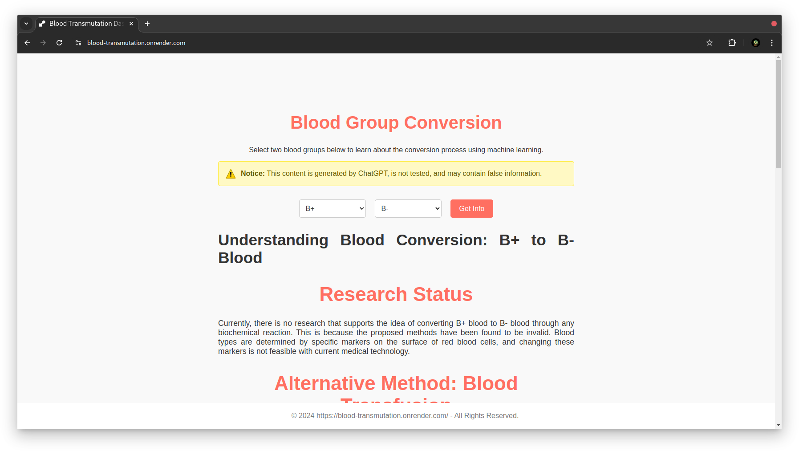

# Blood Transmutation Project

Welcome to the **Blood Transmutation Project**! This innovative web application explores the possibilities of transforming one blood type into another using advanced machine learning techniques.

## Overview

Our application allows users to select two different blood groups and provides information about the potential conversion process between them. The goal is to simulate and understand how machine learning can model complex biochemical transformations in a user-friendly way.

## Key Features

- **Interactive Dashboard**: Easily select blood groups and receive immediate insights.
- **Multi-Level Machine Learning Simulation**: Utilizes a four-level AI model to simulate blood type conversions.
- **User-Friendly Interface**: Designed for simplicity and ease of use.
- **Web-Based Application**: Accessible via any modern web browser without the need for additional software.

## Project Goals

The primary goal of this project is to explore whether **machine learning can solve real-life problems**, specifically the complex challenge of blood type conversion. By modeling the biochemical processes involved, we aim to assess the capabilities and limitations of machine learning in addressing practical, real-world issues.

- **Exploring Machine Learning Applications**: Investigate the potential of AI to tackle complex biological transformations.
- **Education**: To educate users about the applications of machine learning in biomedical fields.
- **Innovation**: To explore new ways of simulating intricate processes using AI.
- **Accessibility**: To make advanced concepts approachable to a wider audience through a user-friendly web interface.

## How the Project Works

### Conceptual Flow

1. **User Interaction**: Users select two blood groups they are interested in converting between.
2. **Data Submission**: The application sends this information to the backend server.
3. **Multi-Level AI Processing**:
   - **Level 1**: Generates combinations and chemical names of blood components.
   - **Level 2**: Uses data from Level 1 to formulate proper chemical reactions.
   - **Level 3**: Categorizes reactions based on the output blood group.
   - **Level 4**: Provides details and returns HTML data used directly in the application.
4. **Response Generation**: The model compiles the information and prepares a comprehensive response.
5. **Result Display**: The application displays the result to the user on the dashboard.

### Technical Components

- **Frontend**:
  - **HTML/CSS/JavaScript**: Provides the structure, styling, and interactivity of the web application.
  - **jQuery**: Simplifies DOM manipulation and AJAX requests.
- **Backend**:
  - **Go (Golang)**: A powerful programming language used for the server-side logic.
  - **ChatGPT Integration**: Emulates the multi-level machine learning model.
- **Communication**:
  - **AJAX Requests**: The frontend communicates with the backend via asynchronous HTTP requests, ensuring a smooth user experience without page reloads.
- **Automation**:
  - **Makefile**: Simplifies the build and run process, allowing the application to be started with a single command.

## Technologies Used

- **Go (Golang)**: Handles server-side operations and logic.
- **ChatGPT**: Provides AI-driven responses and simulates the multi-level machine learning aspects of blood conversion.
- **Makefile**: Automates the compilation and execution of the application.
- **jQuery**: Enhances the frontend interactivity and simplifies AJAX calls.

## How to Use the Application

### Prerequisites

To run the application, ensure you have the following installed on your system:

- **Go (Golang)**: Download from the [official website](https://golang.org/dl/).
- **Make**: Commonly available on Unix-based systems. Windows users can install it or use a Unix compatibility layer like Cygwin.

### Steps to Run

1. **Download the Project**

   - Clone the repository or download the project files to your local machine.

2. **Navigate to the Project Directory**

   - Open your terminal (Command Prompt or PowerShell on Windows).
   - Use the `cd` command to navigate to the project's directory.

3. **Run the Application**

   - Execute the following command:
     ```bash
     make run
     ```
   - This command uses the Makefile to compile and start the application automatically.

4. **Access the Web Application**

   - Open your preferred web browser.
   - Navigate to `http://localhost:8080` (or the port specified in the terminal).
   - You should see the Blood Transmutation Dashboard.

### Using the Dashboard

1. **Select Blood Groups**

   - You'll find two dropdown menus labeled "Blood Group 1" and "Blood Group 2".
   - Click each menu and select the desired blood groups you wish to explore.

2. **Get Information**

   - Click the "Get Info" button.
   - The application will process your request. A loading message will appear briefly.

3. **View Results**

   - Information about the conversion process between the selected blood groups will be displayed.
   - The result includes HTML data returned from Level 4 of the AI model, which is directly used in the application.
   - If there's an error or missing information, an appropriate message will appear.

## Understanding How the Project Works

### Multi-Level Machine Learning Model

The project's core is a four-level AI model designed to simulate the complex process of blood transmutation. Here's how each level contributes:

1. **Level 1 - Component Generation**:

   - **Function**: Identifies and lists the combinations and chemical names of blood components relevant to the selected blood groups.
   - **Outcome**: Provides a detailed breakdown of the necessary elements for the conversion.

2. **Level 2 - Reaction Formulation**:

   - **Function**: Uses the data from Level 1 to generate proper chemical reactions that could facilitate the conversion.
   - **Outcome**: Outlines potential biochemical reactions required.

3. **Level 3 - Categorization**:

   - **Function**: Categorizes the reactions based on their suitability and efficiency in achieving the desired blood group conversion.
   - **Outcome**: Prioritizes reactions that are most feasible.

4. **Level 4 - Details and HTML Data Generation**:

   - **Function**: Provides detailed information on each reaction, including cost estimates and status (e.g., theoretical, experimental).
   - **Outcome**: Returns HTML data that is directly integrated into the application for display to the user.

### The Role of Go and ChatGPT

- **Go (Golang)**:

  - Manages the server-side logic and handles incoming requests.
  - Ensures efficient processing and scalability.

- **ChatGPT Integration**:

  - Simulates the multi-level machine learning model.
  - Generates intelligent and contextually accurate responses.
  - Enhances the application's ability to provide detailed explanations.

## Additional Information

### Project Goals

- **Exploring Machine Learning Applications**: The primary goal of this project is to investigate whether machine learning can solve real-life problems, specifically the complex challenge of blood type conversion. By modeling the biochemical processes involved, we aim to assess the capabilities and limitations of machine learning in addressing practical, real-world issues.

- **Education**: To educate users about the potential applications of machine learning in biomedical fields.

- **Innovation**: To explore new ways of simulating complex processes using AI.

- **Accessibility**: To make advanced concepts approachable to a wider audience through a user-friendly web interface.

### Ethical Considerations

- **Medical Accuracy**: While the application simulates blood transmutation, it's important to note that actual blood type conversion is a highly complex and medically regulated process.

- **Disclaimer**: The project is intended for educational purposes only and should not be used as a medical tool.

### Future Enhancements

- **Optimization**: Improve the multi-level model for more accurate and optimized outputs.

- **Expanded Database**: Include more detailed biochemical data to enhance the simulation.

- **User Feedback**: Implement a feedback system to continually improve the application based on user experiences.

### Benefits of the Project

- **Interdisciplinary Learning**: Bridges biology, chemistry, and computer science, offering a comprehensive learning experience.

- **Simulation of Complex Systems**: Demonstrates how AI can model and simulate intricate biological processes.

- **Real-World Problem Solving**: Tests the potential of machine learning to tackle real-life challenges.

- **Engagement**: Encourages users to interact with the application, fostering curiosity and deeper understanding.

### Potential Applications

- **Medical Education**: Serves as a tool for teaching concepts in hematology and transfusion medicine.

- **Research Visualization**: Helps visualize hypothetical scenarios in blood chemistry research.

- **Public Awareness**: Raises awareness about the complexities and possibilities within biomedical sciences.

## Troubleshooting

- **Cannot Access the Application**: Ensure that Go is properly installed and that you're running the `make run` command in the correct directory.

- **Make Command Not Found**: Install Make or run the Go application directly using `go run main.go` (assuming `main.go` is your entry file).

- **Connection Issues**: Check that the server is running and that there are no firewall restrictions blocking `localhost:8080`.

- **Data Not Loading**: Ensure that the backend server is running and that there are no errors in the console.

- **Incorrect Display**: Refresh the page or clear your browser cache if the results are not displaying correctly.

## Disclaimer

**Important**: The Blood Transmutation Project is a conceptual application intended for educational and informational purposes only. It does not perform actual medical procedures or provide medical advice. Always consult qualified healthcare professionals for medical concerns.

## Output

### Before selecting any blood group


### After selecting blood groups

